

  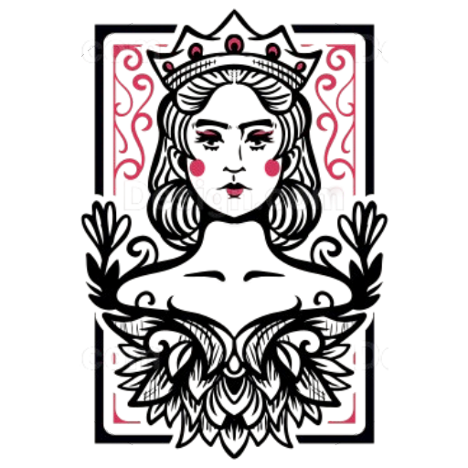
  <h1>🏹 NAUSICAA 🔮</h1>
  <h3>Mythological Strategy Board Game</h3>
  
  
  
  
  
  

    <a href="#game-concept">Game Concept</a> •
    <a href="#core-components">Core Components</a> •
    <a href="#units">Units</a> •
    <a href="#game-mechanics">Game Mechanics</a> •
    <a href="#technical">Technical</a>
  

---

## Game Concept

Nausicaa is a turn-based, deck-building strategy game that brings mythological beings to life on a dynamic 10x8 battlefield. Inspired by chess and mythological warfare, players build decks, manage mana, and strategically deploy legendary creatures to defeat their opponent.

  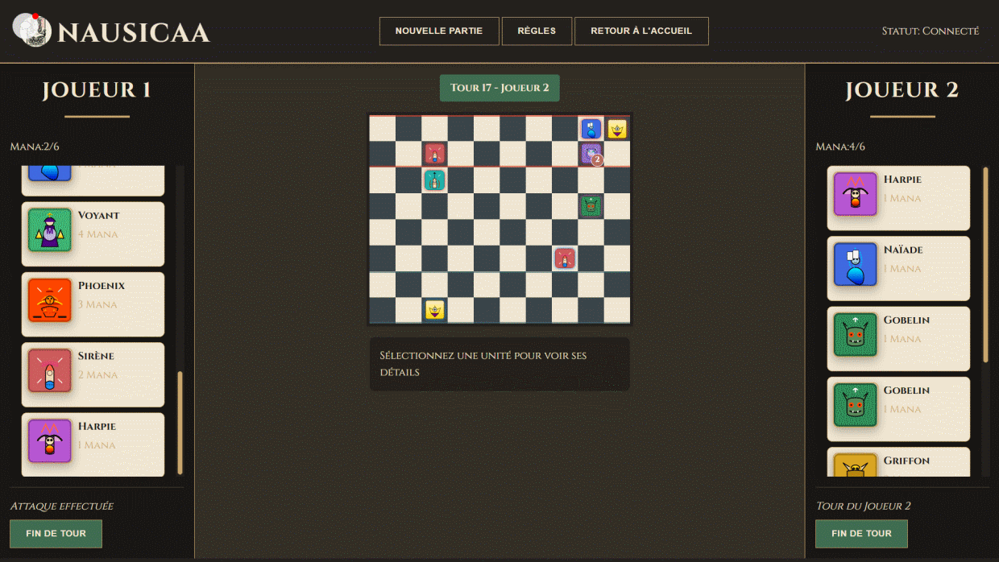

## Core Components

### The Board
- **Dimensions**: 10 x 8 checkerboard
- **Spawn Zones**: 
  - Bottom two rows (Blue): Player 1's deployment area
  - Top two rows (Red): Player 2's deployment area

  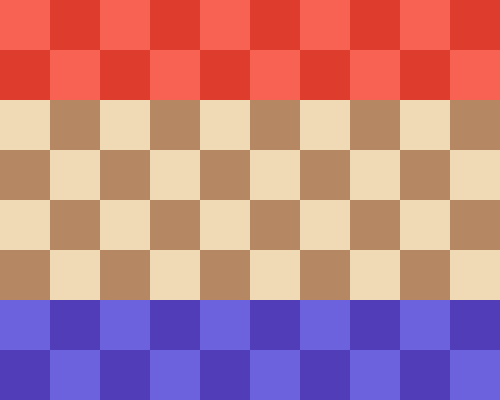

### Objective
Eliminate the opponent's **Oracle** (King equivalent) to win the game.

## Deck Building and Card Mechanics

### Deck Composition
- **Total Units**: 15 mythological beings
- **Deck Preparation**: 
  - Shuffle entire deck at game start
  - Initial draw: 3 units
  - Draw 1 unit at the beginning of each turn

### Mana System

#### Mana Management
- **Mana Range**: 0 - 6 points
- **Mana Progression**:
  - Start with 1 mana
  - Increase by 1 each turn
  - Maximum of 6 mana
  - Mana resets at turn start
  - Unused mana is discarded

#### Mana Spending
1. **Spawning Units**: Each unit has a mana cost
2. **Attacking**: 1 mana per attack
3. **Dashing**: 1 mana for extra movement
4. **Special Abilities**: Varies by unit

## Units

  <h3>🔮 Royal Unit</h3>

<table>
  <tr>
    <th colspan="3">Royal Unit</th>
  </tr>
  <tr>
    <td width="80" align="center">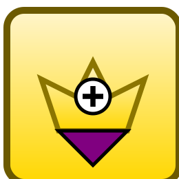</td>
    <td width="120"><strong>Oracle</strong> Cost: Free</td>
    <td>The royal unit that must be protected. Moves to 8 surrounding squares for 1 mana (2 mana to dash). Losing this unit results in defeat.</td>
  </tr>
</table>

  <h3>💰 Low-Cost Units (1 Mana)</h3>

<table>
  <tr>
    <th colspan="3">Low-Cost Units (1 Mana)</th>
  </tr>
  <tr>
    <td width="80" align="center">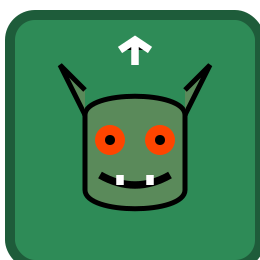</td>
    <td width="120"><strong>Goblin</strong> Cost: 1 Mana</td>
    <td>Basic offensive unit. Moves forward up to 3 squares and attacks in 4 lateral directions.</td>
  </tr>
  <tr>
    <td width="80" align="center">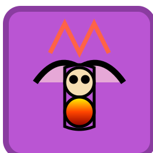</td>
    <td width="120"><strong>Harpy</strong> Cost: 1 Mana</td>
    <td>Moves in 8 surrounding squares. Special ability: One-time explosive attack that destroys surrounding units and itself. Caution: Friendly fire possible.</td>
  </tr>
  <tr>
    <td width="80" align="center"></td>
    <td width="120"><strong>Naiad</strong> Cost: 1 Mana</td>
    <td>Support unit. Draw a card on spawn and when destroyed. Cannot attack.</td>
  </tr>
</table>

  <h3>⚔️ Strategic Units (2 Mana)</h3>

<table>
  <tr>
    <th colspan="3">Strategic Units (2 Mana)</th>
  </tr>
  <tr>
    <td width="80" align="center">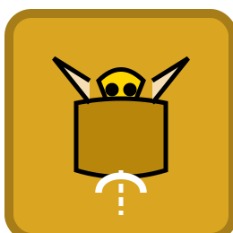</td>
    <td width="120"><strong>Griffin</strong> Cost: 2 Mana</td>
    <td>Hops 2 squares laterally. Draw a card if jumping over any unit.</td>
  </tr>
  <tr>
    <td width="80" align="center">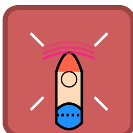</td>
    <td width="120"><strong>Siren</strong> Cost: 2 Mana</td>
    <td>Limited lateral movement. Attacks simultaneously in 4 diagonal squares. Caution: Friendly fire possible.</td>
  </tr>
  <tr>
    <td width="80" align="center">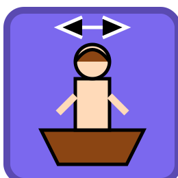</td>
    <td width="120"><strong>Centaur</strong> Cost: 2 Mana</td>
    <td>Can pull any unit 2 squares closer. Uses 1 mana to activate this ability.</td>
  </tr>
</table>

  <h3>🏹 Ranged Units (3 Mana)</h3>

<table>
  <tr>
    <th colspan="3">Ranged Units (3 Mana)</th>
  </tr>
  <tr>
    <td width="80" align="center">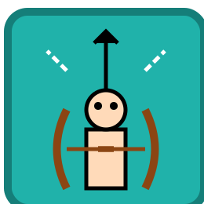</td>
    <td width="120"><strong>Archer</strong> Cost: 3 Mana</td>
    <td>Moves laterally. Attacks with 3-square diagonal range.</td>
  </tr>
  <tr>
    <td width="80" align="center">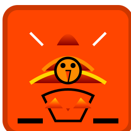</td>
    <td width="120"><strong>Phoenix</strong> Cost: 3 Mana</td>
    <td>Can only spawn/move/attack on specific (dark) tiles. Diagonal movement.</td>
  </tr>
</table>

  <h3>✨ Special Ability Units (4-6 Mana)</h3>

<table>
  <tr>
    <th colspan="3">Special Ability Units (4-6 Mana)</th>
  </tr>
  <tr>
    <td width="80" align="center">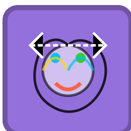</td>
    <td width="120"><strong>Shapeshifter</strong> Cost: 4 Mana</td>
    <td>Can swap places with any unit. Cannot swap with Oracle or attack during the same turn.</td>
  </tr>
  <tr>
    <td width="80" align="center">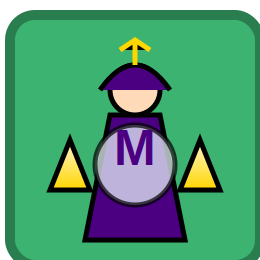</td>
    <td width="120"><strong>Seer</strong> Cost: 4 Mana</td>
    <td>Generates extra mana each turn. Cannot move or attack.</td>
  </tr>
  <tr>
    <td width="80" align="center">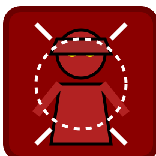</td>
    <td width="120"><strong>Titan</strong> Cost: 6 Mana</td>
    <td>Destroys surrounding units on spawn. Powerful ranged attack with area effect.</td>
  </tr>
</table>

## Game Mechanics

### Movement Rules
- **Free Movement**: 1 square per turn
- **Dashing**: 
  - Costs 1 mana
  - Additional movement
  - Cannot dash and attack in same turn
- **Spawn Restriction**: Units cannot move/attack on turn of spawning

### Attack Mechanics
- **Base Cost**: 1 mana per attack
- **Restriction**: One attack per turn per unit
- **Friendly Fire**: Enabled by default

<!-- 

  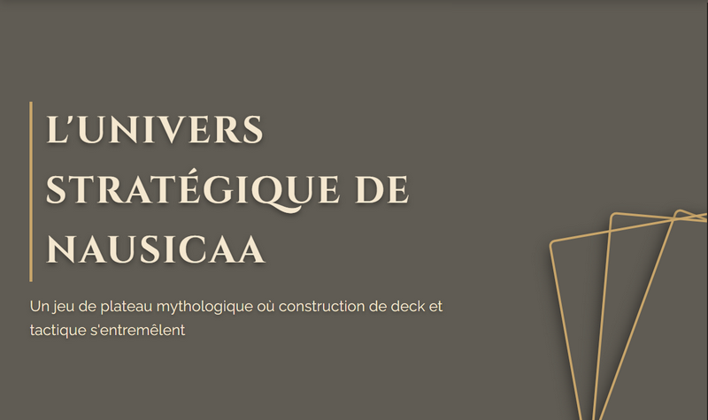

 -->

## ✨ Feature Highlights

  <table>
    <tr>
      <td align="center" width="33%">
        <h3>🎮 Strategic Gameplay</h3>
        
Deep tactical decisions with multiple paths to victory

      </td>
      <td align="center" width="33%">
        <h3>🃏 Deck Building</h3>
        
Create custom decks with mythological beings

      </td>
      <td align="center" width="33%">
        <h3>⚔️ Unique Units</h3>
        
Each unit offers special abilities and play styles

      </td>
    </tr>
  </table>

## Technical

### Implementation
- Web-based implementation with HTML, CSS, and JavaScript
- Supports turn-based multiplayer
- Ideal for real-time and asynchronous play

### Multiplayer Architecture
- **Peer-to-Peer Connectivity**: Built using WebRTC technology for direct player connections
- **PeerJS Framework**: Simplifies WebRTC implementation with easy-to-use API
- **Connection Flow**:
  1. Host generates unique room code
  2. Joining player enters code to establish direct connection
  3. No central server required for gameplay after initial matchmaking
- **Game State Synchronization**:
  - Turn-based actions transmitted directly between players
  - Automatic state verification to prevent desynchronization
  - ~~Reconnection capabilities for dropped connections~~
- **Benefits**:
  - Low latency gameplay
  - Reduced server costs
  - Privacy-focused design
  - Scales easily with player base

### CPU Concept
  For details on the CPU concept and AI implementation, see the [CPU Concept document](./CPU-concept.md). This document outlines the algorithms and strategies used to create a challenging and engaging AI opponent.

### Code Repository

### License

## Contribution
Interested in expanding the game? Contribute by:
- Designing new units
- Creating unique arena layouts
- Balancing game mechanics

---

  
<strong>Created with ❤️ by <a href="https://instagram.com/fox3000foxy">fox3000foxy</a></strong>

  
  &nbsp;
  

